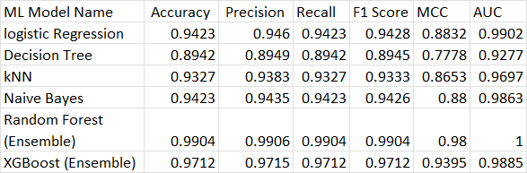

# ML_Model
This repository contains various models to analyse a early stage diabetes risk prediction dataset.
The models are built using Python and various machine learning libraries. 
The repository also includes a Streamlit web application that allows users to interact with the models
and predict the output using that model

Problem Statement-
---------------------------------------------------------------------------------
We need to implement multiple classification models. Build an interactive 
Streamlit web application to demonstrate your models and then deploy the 
app on Streamlit Community Cloud

Dataset used for creating this model- 
https://archive.ics.uci.edu/dataset/529/early+stage+diabetes+risk+prediction+dataset

The Early Stage Diabetes Risk Prediction model helps identify whether an individual is 
at risk of developing diabetes. By analyzing relevant health data, the model enables 
early detection of potential diabetic conditions, allowing timely treatment. This proactive 
approach can significantly improve health outcomes and reduce long-term complications.

Comparison Table with the evaluation metrics
----------------------------------------------------------------------------------

